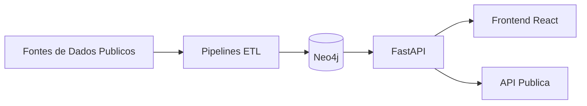

# br/acc open graph

[](../brand/bracc-header.jpg)

[English](../../README.md) | [Portugues](README.md)

**Infraestrutura open-source em grafo que cruza bases publicas brasileiras para gerar inteligencia acionavel para melhoria civica.**

[](https://github.com/brunoclz/br-acc/actions/workflows/ci.yml)
[](https://www.gnu.org/licenses/agpl-3.0)
[](https://github.com/brunoclz/br-acc/commits)
[](https://github.com/brunoclz/br-acc/issues)
[](https://github.com/brunoclz/br-acc/stargazers)
[](https://github.com/brunoclz/br-acc/network/members)
[](https://x.com/brunoclz)
[](https://discord.gg/YyvGGgNGVD)

[Discord](https://discord.gg/YyvGGgNGVD) | [Twitter](https://x.com/brunoclz) | [Website](https://bracc.org) | [Contribuir](#contribuindo)

---

## O que e br/acc?

br/acc e um movimento descentralizado de builders brasileiros usando tecnologia e dados abertos para tornar informacao publica mais acessivel. Este repositorio e um de seus projetos: uma infraestrutura open-source em grafo que ingere bases de dados publicas brasileiras oficiais — registros de empresas, saude, educacao, emprego, financas publicas, licitacoes, meio ambiente — e normaliza tudo em um unico grafo consultavel.

Ele torna dados publicos que ja sao abertos, mas espalhados em dezenas de portais, acessiveis em um so lugar. Nao interpreta, pontua ou classifica resultados — apenas exibe conexoes e deixa os usuarios tirarem suas proprias conclusoes.

[Saiba mais em bracc.org](https://bracc.org)

---

## Funcionalidades

- **45 modulos ETL implementados** — status rastreado em `docs/source_registry_br_v1.csv` (loaded/partial/stale/blocked/not_built)
- **Infraestrutura de grafo Neo4j** — schema, loaders e superficie de consulta para entidades e relacionamentos
- **Frontend React** — busque, explore redes empresariais e analise conexoes de entidades
- **API publica** — acesso programatico aos dados do grafo via FastAPI
- **Ferramentas de reprodutibilidade** — bootstrap local em um comando e fluxo BYO-data para ETL
- **Privacy-first** — compativel com LGPD, defaults publicos seguros, sem exposicao de dados pessoais

---

## Inicio Rapido

```bash
cp .env.example .env
make bootstrap-demo
```

Esse comando inicia os servicos Docker, espera Neo4j/API ficarem saudaveis e carrega seed deterministico de desenvolvimento.

Verifique em:

- API: http://localhost:8000/health
- Frontend: http://localhost:3000
- Neo4j Browser: http://localhost:7474

### Subir com Docker

Voce pode subir a stack (Neo4j, API, frontend) com Docker Compose sem rodar o bootstrap completo:

```bash
cp .env.example .env
docker compose up -d
```

Opcional: incluir o servico ETL (para rodar pipelines no container):

```bash
docker compose --profile etl up -d
```

As mesmas URLs de verificacao valem. Para um grafo demo pronto com dados de seed, use `make bootstrap-demo`.

---

## Fluxo Em Um Comando

```bash
# Fluxo demo local (recomendado para primeira execucao)
make bootstrap-demo

# Orquestracao pesada de ingestao completa (Docker + todos pipelines implementados)
make bootstrap-all

# Execucao pesada nao interativa (automacao)
make bootstrap-all-noninteractive

# Exibir ultimo relatorio do bootstrap-all
make bootstrap-all-report
```

`make bootstrap-all` e propositalmente pesado:
- alvo padrao de ingestao historica completa
- pode levar horas (ou mais), dependendo das fontes externas
- exige disco, memoria e banda de rede significativos
- continua em caso de erro e grava resumo auditavel por fonte em `audit-results/bootstrap-all/`

Guia detalhado: [`docs/bootstrap_all.md`](../bootstrap_all.md)

---

## O Que Esta Incluido Neste Repositorio Publico

- Codigo de API, frontend, framework ETL e infraestrutura.
- Registro de fontes e documentacao de status de pipelines.
- Dataset demo sintetico e caminho deterministico de seed local.
- Gates publicos de seguranca/compliance e documentacao de release.

## O Que Nao Esta Incluido Por Padrao

- Dump Neo4j de producao pre-populado.
- Garantia de estabilidade/disponibilidade de todos os portais externos.
- Modulos institucionais/privados e runbooks operacionais internos.

## O Que E Reproduzivel Localmente Hoje

- Subida completa local (`make bootstrap-demo`) com grafo demo.
- Fluxo BYO-data via pipelines `bracc-etl`.
- Orquestracao pesada em um comando (`make bootstrap-all`) com relatorio explicito de fontes bloqueadas/falhas.
- Comportamento da API publica em modo seguro de privacidade.

Contadores de escala de producao sao publicados como **snapshot de referencia de producao** em [`docs/reference_metrics.md`](../reference_metrics.md), nao como resultado esperado do bootstrap local.

---

## Arquitetura

| Camada | Tecnologia |
|---|---|
| Banco de Grafo | Neo4j 5 Community |
| Backend | FastAPI (Python 3.12+, async) |
| Frontend | Vite + React 19 + TypeScript |
| ETL | Python (pandas, httpx) |
| Infra | Docker Compose |



---

## Mapa do Repositorio

```
api/          Backend FastAPI (rotas, servicos, modelos)
etl/          Pipelines ETL e scripts de download
frontend/     App React (Vite + TypeScript)
infra/        Docker, schema Neo4j, scripts de seed
scripts/      Scripts utilitarios e de automacao
docs/         Documentacao, assets de marca, indice legal
data/         Datasets baixados (ignorado pelo git)
```

---

## Referencia da API

| Metodo | Rota | Descricao |
|---|---|---|
| GET | `/health` | Health check |
| GET | `/api/v1/public/meta` | Metricas agregadas e saude das fontes |
| GET | `/api/v1/public/graph/company/{cnpj_or_id}` | Subgrafo publico de empresa |
| GET | `/api/v1/public/patterns/company/{cnpj_or_id}` | Analise de padroes (quando habilitado) |

Documentacao interativa completa em `http://localhost:8000/docs` apos iniciar a API.

---

## Contribuindo

Contribuicoes de todos os tipos sao bem-vindas — codigo, pipelines de dados, documentacao e relatos de bugs. Veja as issues abertas para primeiras tarefas, ou abra uma nova para discutir sua ideia.

Se voce achou o projeto util, **de uma estrela no repo** — ajuda outras pessoas a descobri-lo.

---

## Apoie o Projeto

[](https://github.com/sponsors/brunoclz)

Se quiser apoiar o desenvolvimento diretamente:

| Rede | Endereco |
|---|---|
| Solana | `HFceUyei1ndQypNKoiYSsHLHrVcaMZeNBeRhs8LmmkLn` |
| Ethereum | `0xbB3538D3e1B1Dd7c916BE7DfAC9ac7e322f592c7` |

---

## Comunidade

- **Discord**: [discord.gg/YyvGGgNGVD](https://discord.gg/YyvGGgNGVD)
- **Twitter**: [@brunoclz](https://x.com/brunoclz)
- **Website**: [bracc.org](https://bracc.org)
- **Comunidade Brazilian Accelerationism** no X

---

## Legal e Etica

Todos os dados processados por este projeto sao publicos por lei. Cada fonte e publicada por um portal do governo brasileiro ou iniciativa internacional de dados abertos, disponibilizada sob um ou mais dos seguintes instrumentos legais:

| Lei | Escopo |
|---|---|
| **CF/88 Art. 5 XXXIII, Art. 37** | Direito constitucional de acesso a informacao publica |
| **Lei 12.527/2011 (LAI)** | Lei de Acesso a Informacao — regula o acesso a dados governamentais |
| **LC 131/2009 (Lei da Transparencia)** | Obriga publicacao em tempo real de dados fiscais e orcamentarios |
| **Lei 13.709/2018 (LGPD)** | Protecao de dados — Art. 7 IV/VII permitem tratamento de dados publicos para interesse publico |
| **Lei 14.129/2021 (Governo Digital)** | Obriga dados abertos por padrao para orgaos governamentais |

<details>
<summary><b>Matriz de Datasets Brasil (Base Legal)</b></summary>

| # | Fonte | Portal | Base Legal |
|---|-------|--------|------------|
| 1 | CNPJ (Cadastro de Empresas) | Receita Federal | LAI, CF Art. 37 |
| 2 | TSE (Eleicoes e Doacoes) | dadosabertos.tse.jus.br | Lei 9.504/1997 (Lei Eleitoral), LAI |
| 3 | Portal da Transparencia | portaldatransparencia.gov.br | LC 131/2009, LAI |
| 4 | CEIS/CNEP (Sancoes) | Portal da Transparencia | LAI, Lei 12.846/2013 (Lei Anticorrupcao) |
| 5 | BNDES (Emprestimos) | bndes.gov.br | LAI, LC 131/2009 |
| 6 | PGFN (Divida Ativa) | portaldatransparencia.gov.br | LAI, Lei 6.830/1980 |
| 7 | ComprasNet (Licitacoes) | comprasnet.gov.br | Lei 14.133/2021 (Licitacoes), LAI |
| 8 | TCU (Sancoes de Auditoria) | portal.tcu.gov.br | LAI, CF Art. 71 |
| 9 | TransfereGov | transferegov.sistema.gov.br | LC 131/2009, LAI |
| 10 | RAIS (Estatisticas Trabalhistas) | PDET/MTE | LAI (agregado, sem dados pessoais) |
| 11 | INEP (Censo Educacional) | dados.gov.br | LAI, Lei 14.129/2021 |
| 12 | DataSUS/CNES (Saude) | datasus.saude.gov.br | LAI, Lei 8.080/1990 (SUS) |
| 13 | IBAMA (Embargos) | dados.gov.br | LAI, Lei 9.605/1998 (Crimes Ambientais) |
| 14 | DOU (Diario Oficial) | in.gov.br | CF Art. 37 (publicidade) |
| 15 | Camara (Despesas de Deputados) | dadosabertos.camara.leg.br | LAI, CF Art. 37 |
| 16 | Senado (Despesas de Senadores) | dadosabertos.senado.leg.br | LAI, CF Art. 37 |
| 17 | ICIJ (Offshore Leaks) | offshoreleaks.icij.org | Base de dados jornalistica de interesse publico |
| 18 | OpenSanctions (PEPs Globais) | opensanctions.org | Agregador open-data (licenca CC) |
| 19 | CVM (Processos de Valores Mobiliarios) | dados.cvm.gov.br | LAI, Lei 6.385/1976 |
| 20 | CVM Fundos | dados.cvm.gov.br | LAI, Lei 6.385/1976 |
| 21 | Servidores Publicos | Portal da Transparencia | LC 131/2009, LAI |
| 22 | CEAF (Servidores Expulsos) | portaldatransparencia.gov.br | LAI, Lei 8.112/1990 |
| 23 | CEPIM (ONGs Impedidas) | portaldatransparencia.gov.br | LAI |
| 24 | CPGF (Cartoes Corporativos) | portaldatransparencia.gov.br | LC 131/2009, LAI |
| 25 | Viagens a Servico | portaldatransparencia.gov.br | LC 131/2009, LAI |
| 26 | Renuncias Fiscais | portaldatransparencia.gov.br | LC 131/2009, LAI |
| 27 | Acordos de Leniencia | portaldatransparencia.gov.br | Lei 12.846/2013, LAI |
| 28 | BCB Penalidades | dados.bcb.gov.br | LAI, Lei 4.595/1964 |
| 29 | STF (Supremo Tribunal Federal) | portal.stf.jus.br | CF Art. 93 IX (publicidade judiciaria) |
| 30 | PEP CGU | portaldatransparencia.gov.br | LAI, Decreto 9.687/2019 |
| 31 | TSE Bens (Patrimonio de Candidatos) | dadosabertos.tse.jus.br | Lei 9.504/1997 |
| 32 | TSE Filiados (Filiacao Partidaria) | dadosabertos.tse.jus.br | Lei 9.096/1995 (Lei dos Partidos) |
| 33 | OFAC SDN | treasury.gov | Lista publica de sancoes dos EUA |
| 34 | EU Sanctions | data.europa.eu | Lista publica de sancoes da UE |
| 35 | UN Sanctions | un.org | Lista publica do Conselho de Seguranca da ONU |
| 36 | World Bank Debarment | worldbank.org | Lista publica de impedimentos |
| 37 | Holdings (derivado) | — | Derivado dos dados CNPJ |
| 38 | SIOP (Emendas Orcamentarias) | siop.planejamento.gov.br | LC 131/2009, LAI |
| 39 | Senado CPIs | dadosabertos.senado.leg.br | LAI, CF Art. 58 §3 |

</details>

Todos os achados sao apresentados como conexoes de dados atribuidas a fontes, nunca como acusacoes. A plataforma aplica defaults publicos seguros que impedem exposicao de informacoes pessoais em deployments publicos.

<details>
<summary><b>Defaults publicos seguros</b></summary>

```
PRODUCT_TIER=community
PUBLIC_MODE=true
PUBLIC_ALLOW_PERSON=false
PUBLIC_ALLOW_ENTITY_LOOKUP=false
PUBLIC_ALLOW_INVESTIGATIONS=false
PATTERNS_ENABLED=false
VITE_PUBLIC_MODE=true
VITE_PATTERNS_ENABLED=false
```
</details>

- [ETHICS.md](../../ETHICS.md)
- [LGPD.md](../../LGPD.md)
- [PRIVACY.md](../../PRIVACY.md)
- [TERMS.md](../../TERMS.md)
- [DISCLAIMER.md](../../DISCLAIMER.md)
- [SECURITY.md](../../SECURITY.md)
- [ABUSE_RESPONSE.md](../../ABUSE_RESPONSE.md)
- [Indice Legal](../legal/legal-index.md)

---

## Releases

- [Historico de releases](https://github.com/brunoclz/br-acc/releases)
- [Politica de releases](../release/release_policy.md)
- [Runbook do mantenedor](../release/release_runbook.md)

---

## Licenca

[GNU Affero General Public License v3.0](../../LICENSE)
